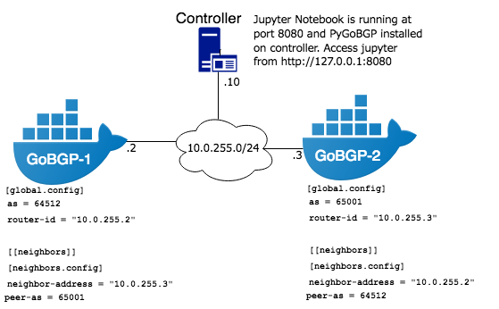

# PyGoBGP Examples (Docker)
[PyGoBGP](https://github.com/oneryalcin/PyGoBGP) is a python library to interact with GoBGP. Below is an example docker setup to run two GoBGP routers and a controller node. Controller has `PyGoBGP` and Jupyter notebook installed and can access GoBGP routers. Controller can manipulate GoBGP router RIB, or change neighbor configs programmatically.  

This setup is influenced by David Barroso's [GoBGP examples](https://github.com/dbarrosop/gobgp-grpc-demo).



# Requirements
* docker 
* docker-compose

# Environment Setup

Create docker images and bring them up
```
make build
make up
```

Now you should be able to access jupyter notebook at http://127.0.0.1:8080

Connect to one of the GoBGP Nodes and check BGP session

```python
from pygobgp import PyGoBGP
gobgp = PyGoBGP(address="10.0.255.2")

neighbor = gobgp.get_neighbor(address="10.0.255.3")

print(neighbor.info.bgp_state)
>>> "established"

print(neighbor.conf.peer_as)
>>> 65001
```

Check [PyGoBGP](https://github.com/oneryalcin/PyGoBGP) github page for more details
